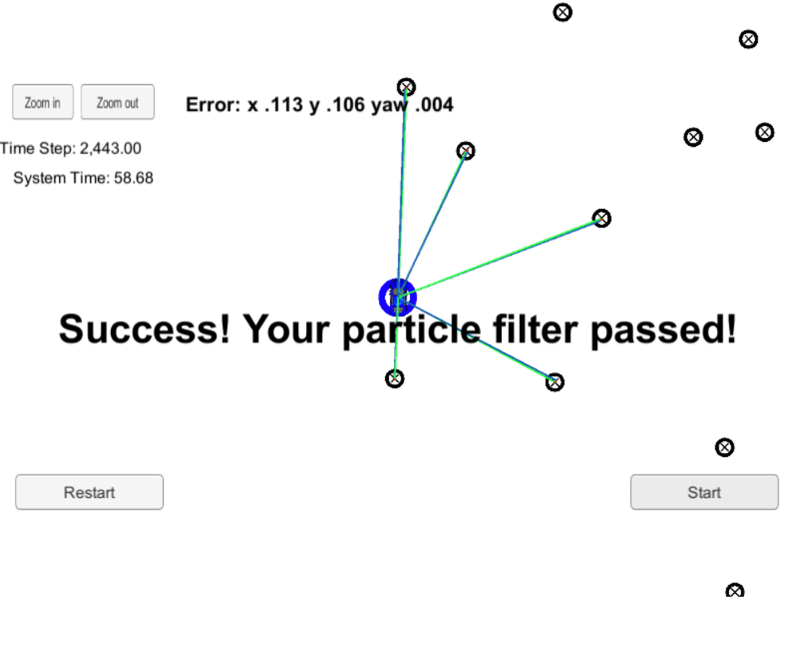

# Particle Filter

## 1. Introduction
This project implements a Particle Filter in C++ to perform markov localization in a given map using noisy LIDAR measurements passed via a simulator. This project was completed as part of Term 2 of Udacity's Self-Driving Car Nanodegree program.

## 2. Project Environment
The project was built using the Ubuntu 16-04 bash shell in Windows 10. Instructions to set this up can be found [here](https://www.howtogeek.com/249966/how-to-install-and-use-the-linux-bash-shell-on-windows-10/). The following dependencies need to be in place to build and execute the project.

* [Udacity SDC Term 2 Simulator](https://github.com/udacity/self-driving-car-sim/releases)
* cmake >= 3.5
* make >= 4.1 (Linux, Mac), 3.81 (Windows)
* gcc/g++ >= 5.4
* uWebSocketIO (installed via the [install-ubuntu.sh](https://github.com/shazraz/Extended-Kalman-Filter/blob/master/install-ubuntu.sh) script) 

The project consists primarily of the following files located in the [src](https://github.com/shazraz/Particle-Filter/tree/master/src) folder:

* [main.cpp](https://github.com/shazraz/Particle-Filter/blob/master/src/main.cpp): Interfaces with the simulator using uWebSocketIO to recieve measurements and transmit the location and measurement associations of the highest weighted particle.
* [particle_filter.cpp](https://github.com/shazraz/Particle-Filter/blob/master/src/particle_filter.cpp): Defines the intialization, prediction, weight update & resampling methods of the particle filter class.

Once the environment is ready, the code can be tested as follows:

1. OPTIONAL: Modify the ```num_particles``` parameter in particle_filter.cpp 
3. OPTIONAL: cd build
4. OPTIONAL: make
5. Launch the simulator and select the Kidnapped Vehicle project
6. Execute ```./particle_filter``` from the build directory
7. Click Start in the simulator

The simulator shows a blue vehicle navigating a map with known landmarks. The green lines define the ground truth associations between the LIDAR measurements of landmarks and the vehicle, the overlaid blue lines define the estimated associations based on the predicted LIDAR measurements of the best localized particle (i.e. particle with highest weight)

## 3. Results & Discussion

This particle filter implements the bicycle motion model to perform its prediction step when translating the initial particle positions followed by a nearest neighbor data association to associate each measurement with a landmark. Concretely, each measurement vector recieved by the particle filter is first transformed into map coordinates and then associated with a landmark ID provided in the given map using the minimum Euclidean distance between the predicted measurement and actual landmark coordinates. The image below shows the result once the vehicle has navigated the entire course.


